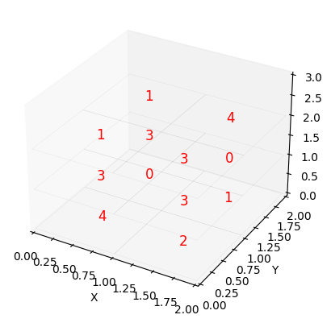

```
import numpy as np
import matplotlib.pyplot as plt
from mpl_toolkits.mplot3d import Axes3D

# Define the matrix
w = np.random.randint(5, size=(2, 2, 3))

# Get the shape of the matrix
width, height, depth = w.shape

# Create a figure and a 3D axis
fig = plt.figure()
ax = fig.add_subplot(111, projection='3d')

# Iterate over each block in the matrix
for z in range(depth):
    for y in range(height):
        for x in range(width):
            # Get the number in the current block
            number = w[x, y, z]
            
            # Plot a cube with the number as the label
            ax.text(x + 0.7, y + 0.25, z + 0.5, str(number), color='red', ha='center', va='center', fontsize=12)
            
            # Plot the edges of the cube with a line width of 2
            ax.plot([x, x+1, x+1, x, x], [y, y, y+1, y+1, y], [z, z, z, z, z], 'grey', linewidth=0.05)

# Set the labels for the axes
ax.set_xlabel('X')
ax.set_ylabel('Y')
ax.set_zlabel('Z')

# Set the plot limits
ax.set_xlim(0, width)
ax.set_ylim(0, height)
ax.set_zlim(0, depth)

# Hide the grid
ax.grid(False)

# Show the plot
plt.show()

```
    

    
```
# x=0; y=0, z=0
print("\nx=0\n",w[0,:,:],"\ny=0\n",w[:,0,:],"\nz=0\n",w[:,:,0])
```

    
    x=0
     [[4 3 1]
     [0 3 1]] 
    y=0
     [[4 3 1]
     [2 3 3]] 
    z=0
     [[4 0]
     [2 1]]
    


```
np.sum(w, axis=2)
```
    array([[8, 4],
           [8, 5]])


