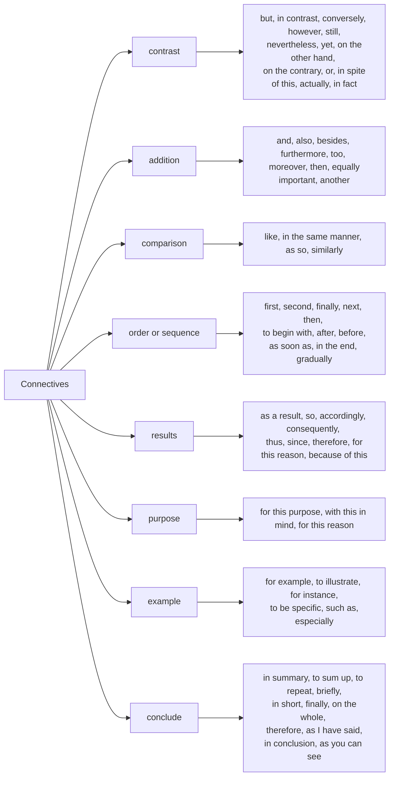

```mermaid
flowchart LR
    ROOT[Connectives] --> A & B & C & D & E & F & G & H
    A[contrast] --> 
        AA[but, in contrast, conversely, however, still,<br> nevertheless, yet, on the other hand, <br> on the contrary, or, in spite of this, actually, in fact]
    B[addition] --> 
        BB[and, also, besides, furthermore, too, <br> moreover, then, equally important, another]
    C[comparison] --> 
        CC[like, in the same manner, as so, similarly]
    D[order or sequence] --> 
        DD[first, second, finally, next, then, <br> to begin with, after, before, as soon as, in the end, gradually]
    E[results] --> 
        EE[as a result, so, accordingly, consequently, <br> thus, since, therefore, for this reason, because of this]
    F[purpose] --> 
        FF[for this purpose, with this in mind, for this reason]
    G[example] --> 
        GG[for example, to illustrate, for instance,<br> to be specific, such as, especially]    
    H[conclude] --> 
        HH[in summary, to sum up, to repeat, briefly,<br> in short, finally, on the whole, <br> therefore, as I have said, in conclusion, as you can see]
    click A "(#but)" "This is a tooltip for a link"
```

## example
### contrast
1.  it is raining but the sun still shines.